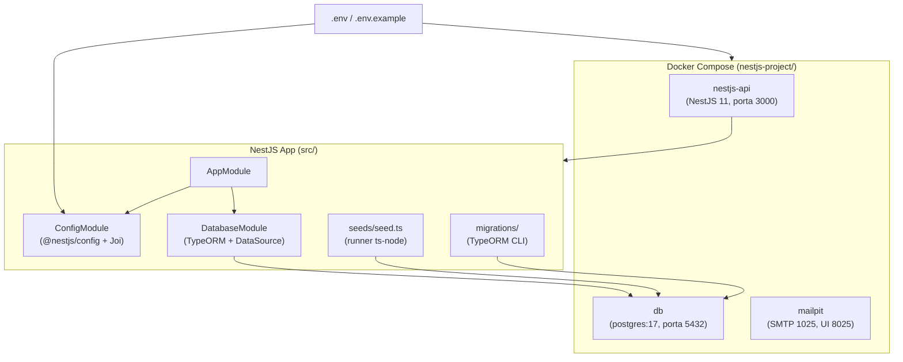

# Plano de Implementação: Fase 01 — Fundação

## 1. Visão Geral

Estabelecer a fundação do monorepo StreamTube: versionamento Git unificado, ambiente Docker Compose validado, gestão de configuração com `@nestjs/config`, TypeORM com migrations e seed runner, e documentação da fundação de IA.

**Valor:** Elimina configuração duplicada, garante build reproduzível e estabelece contratos de infraestrutura que todas as fases futuras dependem.

---

## 2. Conformidade e Boas Práticas (MCP Context7)

**@nestjs/config (consultado via Context7 /nestjs/docs.nestjs.com):**
- `ConfigModule.forRoot({ isGlobal: true, validationSchema: Joi.object({...}) })`
- Usar `Joi` para validação de schema — abortEarly: true, allowUnknown: true
- `ConfigService` tipado via `get<T>('KEY')`

**TypeORM (consultado via Context7 /typeorm/typeorm):**
- `synchronize: false` — obrigatório em todos os ambientes
- `DataSource` separado para CLI (`data-source.ts`)
- `migrationsTableName: 'typeorm_migrations'`
- Glob: `src/database/migrations/**/*{.js,.ts}`

**Docker:**
- `depends_on: condition: service_healthy` — API só sobe após db healthy
- `env_file` + variáveis explícitas — nunca hardcode de credenciais

---

## 3. Análise de Impacto

| Arquivo | Ação | IE |
|---------|------|----|
| `(raiz)/.git` | Criar | IE-01.1 |
| `(raiz)/.gitignore` | Criar | IE-01.1 |
| `nestjs-project/.git` | Remover | IE-01.1 |
| `nestjs-project/.env` | Criar | IE-01.2 |
| `nestjs-project/.env.example` | Criar | IE-01.2 |
| `nestjs-project/compose.yaml` | Atualizar (env vars) | IE-01.2 |
| `nestjs-project/src/config/env.validation.ts` | Criar | IE-01.3 |
| `nestjs-project/src/app.module.ts` | Atualizar | IE-01.3, IE-01.4 |
| `nestjs-project/src/database/data-source.ts` | Criar | IE-01.4 |
| `nestjs-project/src/database/database.module.ts` | Criar | IE-01.4 |
| `nestjs-project/src/database/migrations/` | Criar (vazio) | IE-01.4 |
| `nestjs-project/src/database/database.integration.spec.ts` | Criar | IE-01.4 |
| `nestjs-project/src/database/seeds/seed.ts` | Criar | IE-01.5 |
| `nestjs-project/package.json` | Atualizar scripts | IE-01.4, IE-01.5 |
| `docs/ai-foundation.md` | Criar | IE-01.6 |

---

## 4. Arquitetura



---

## 5. Tarefas de Implementação

### Grupo 1: IE-01.1 — Git Setup

| # | Componente | Ação |
|---|-----------|------|
| 1.1 | `(raiz)` | `git init` |
| 1.2 | `(raiz)/.gitignore` | Criar cobrindo node_modules, dist, coverage, .env, artefatos IDE |
| 1.3 | `nestjs-project/.git` | `rm -rf` (remover git aninhado) |
| 1.4 | `(raiz)` | `git add .` + commit inicial |
| 1.5 | `(raiz)` | Criar branch `dev` |

### Grupo 2: IE-01.2 — Docker Compose

| # | Componente | Ação |
|---|-----------|------|
| 2.1 | `nestjs-project/.env` | Criar com DB_HOST=db, DB_PORT, DB_USER, DB_PASSWORD, DB_NAME, MAIL_HOST, MAIL_PORT |
| 2.2 | `nestjs-project/.env.example` | Criar (template sem valores reais) |
| 2.3 | `nestjs-project/compose.yaml` | Atualizar: env_file, env vars via ${VAR} |

### Grupo 3: IE-01.3 — @nestjs/config

| # | Componente | Ação |
|---|-----------|------|
| 3.1 | `package.json` | `npm install @nestjs/config@^4.0.0 joi` |
| 3.2 | `src/config/env.validation.ts` | Criar schema Joi com todas as variáveis obrigatórias |
| 3.3 | `src/app.module.ts` | Adicionar `ConfigModule.forRoot({ isGlobal: true, validationSchema })` |

### Grupo 4: IE-01.4 — TypeORM

| # | Componente | Ação |
|---|-----------|------|
| 4.1 | `package.json` | `npm install @nestjs/typeorm@^11.0.0 typeorm@^0.3.0 pg@^8.0.0` |
| 4.2 | `src/database/data-source.ts` | DataSource com env vars, synchronize:false, migrations glob |
| 4.3 | `src/database/database.module.ts` | TypeOrmModule.forRootAsync com ConfigService |
| 4.4 | `src/app.module.ts` | Importar DatabaseModule |
| 4.5 | `package.json` | Scripts migration:generate/run/revert/show |
| 4.6 | `src/database/migrations/` | Criar diretório (com .gitkeep) |
| 4.7 | `src/database/database.integration.spec.ts` | Teste de integração: boot + DataSource conecta ao pg real |

### Grupo 5: IE-01.5 — Seed Runner

| # | Componente | Ação |
|---|-----------|------|
| 5.1 | `src/database/seeds/seed.ts` | Runner que inicializa DataSource e executa seeders registrados |
| 5.2 | `package.json` | Script `seed` via ts-node |

### Grupo 6: IE-01.6 — AI Foundation Doc

| # | Componente | Ação |
|---|-----------|------|
| 6.1 | `docs/ai-foundation.md` | Documentar skills, rules, MCP, CLAUDE.md, skills-lock.json |

---

## 6. Sequência de Implementação

```
IE-01.1 (Git) → IE-01.6 (AI doc, depende de .claude/ estar versionado)
IE-01.2 (Docker .env) → IE-01.3 (ConfigModule) → IE-01.4 (TypeORM) → IE-01.5 (Seed)
```

---

## 7. Testes Requeridos

| Arquivo | Tipo | Verifica |
|---------|------|----------|
| `src/database/database.integration.spec.ts` | Integração | App boota + DataSource conecta ao Postgres real; synchronize desativado |

---

## 8. Checklist de Qualidade

- [ ] `git status` na raiz rastreia nestjs-project/, docs/, .claude/
- [ ] Não existe .git aninhado em nestjs-project/
- [ ] Branches main e dev existem
- [ ] .env, node_modules/, dist/ ignorados
- [ ] `docker compose up -d` sobe os 3 serviços
- [ ] `docker compose exec db pg_isready -U streamtube` → accepting connections
- [ ] App falha ao iniciar sem variável obrigatória
- [ ] `npm run migration:run` cria apenas typeorm_migrations
- [ ] `npm run seed` retorna exit code 0
- [ ] `docs/ai-foundation.md` existe

---

## 9. Referências (MCP Context7)

- `/nestjs/docs.nestjs.com` — ConfigModule.forRoot, validationSchema Joi
- `/typeorm/typeorm` — DataSource, migrations setup, synchronize:false
